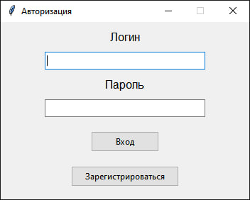
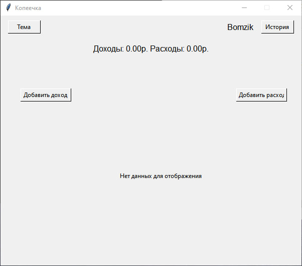
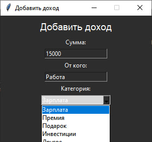
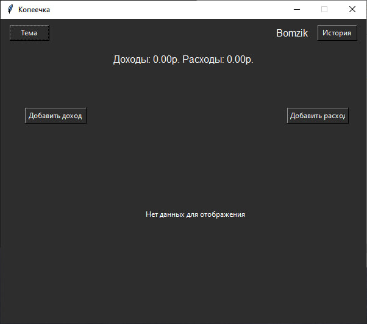
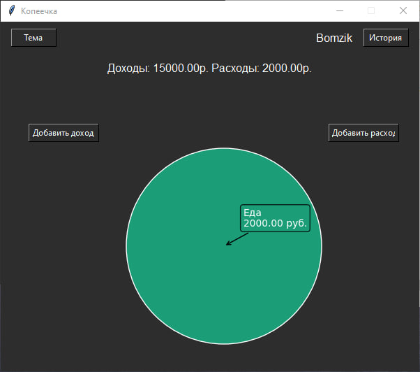
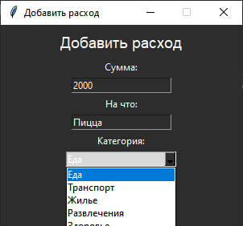

# Financial Managment
---
### Программа на Tkinter для контроля своих финансов.

При запуске программы нас встречает окно Авторизации.

*При регистрации данные сохраняются в json файл*

После входа нас встречает основное окно, в котором есть:
- Смена темы

- Добавление расходов/доходов

- Просмотр истории

- График трат

